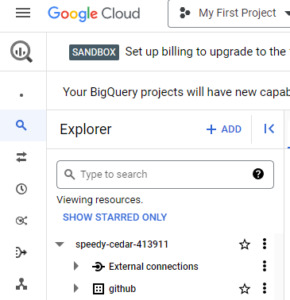
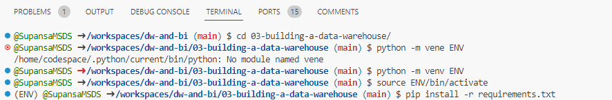
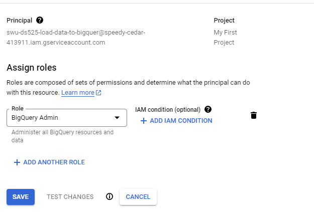
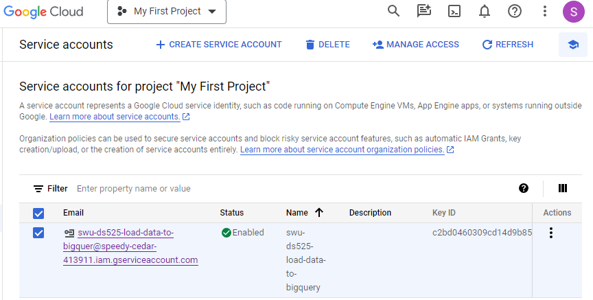
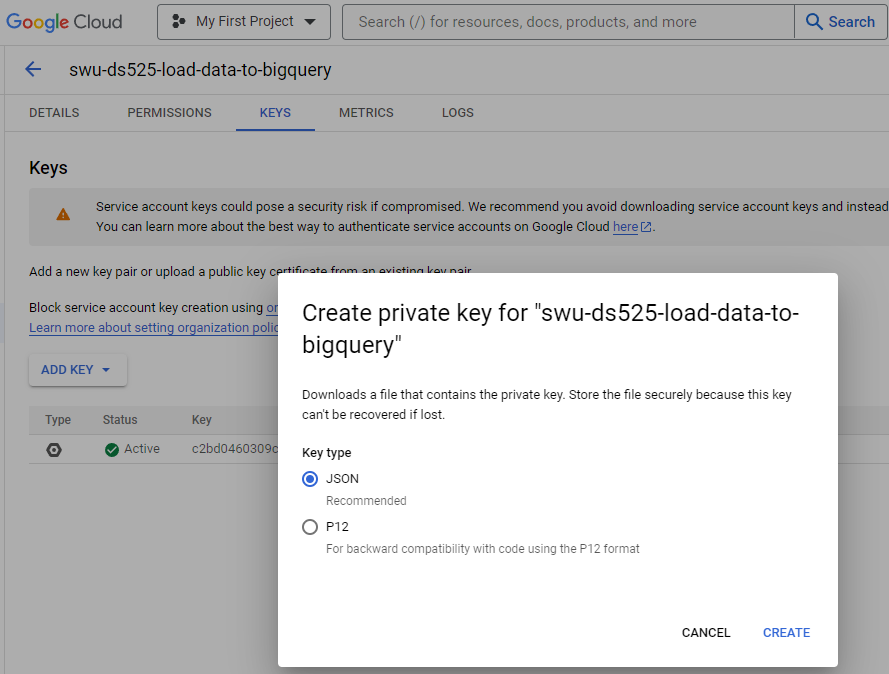
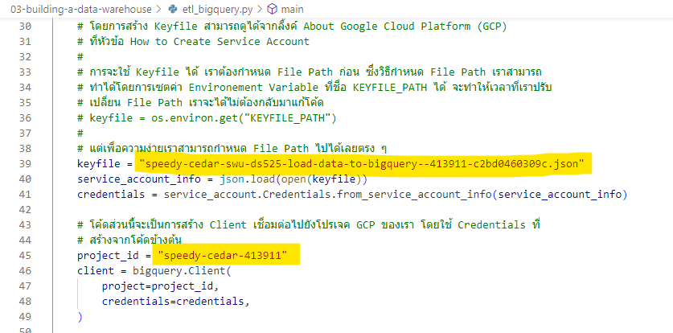
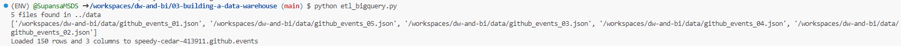
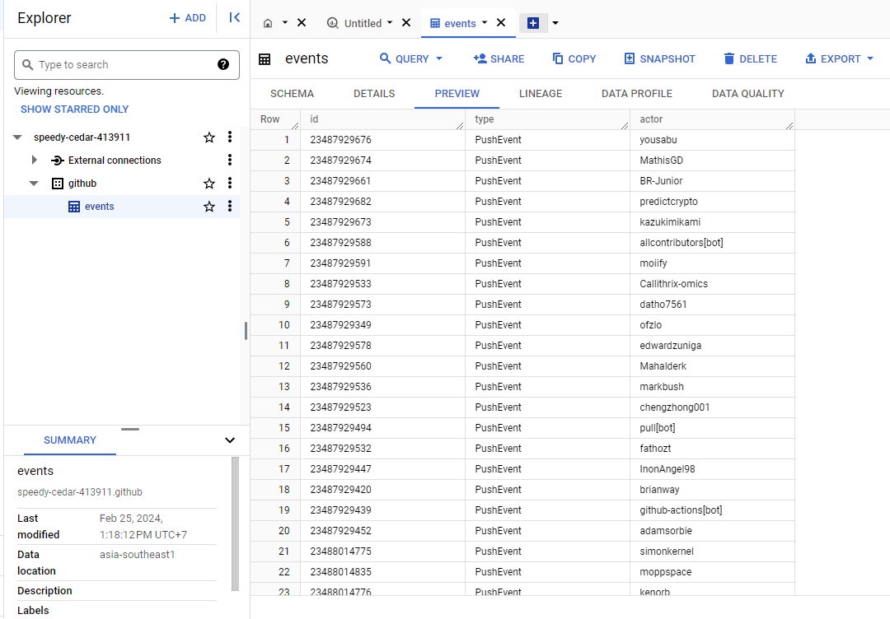
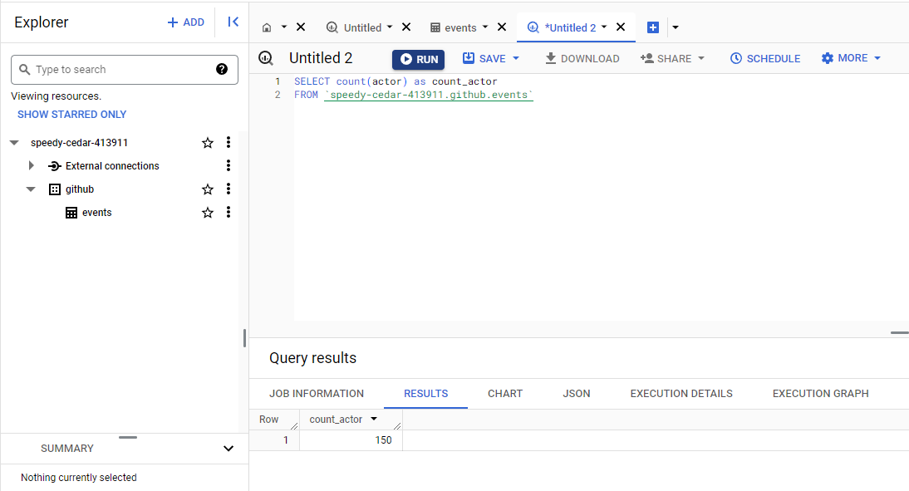

##Building a Data Lake
#1.สร้าง Data set ชื่อ github บน bigquery

#1.pip install -r requirements.txt

#2.สร้าง service account บน bigquery และกำหนดสิทธิ์

#3.เข้าไป service account แล้วทำการ download key เลือก Key type เป็น JSON

#4. นำไฟล์ Key ที่  download มาไว้ที่ Folder 03-building-a-data-warehouse 
#5.ไปที่ etl_bigquery.py แล้วนำชื่อไฟล์ Key ไปใส่ใน Key parth และใส่ชื่อ project_id ให้ตรงกับบน bigquery

#6.python etl_bigquery.py

#7.ไปที่ bigqury จะพบ table events ที่สร้างขึ้นมา

#8.ทดลอง query data บน bigquery
